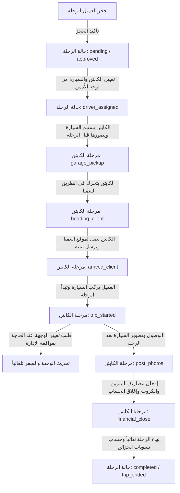

# 📑 دليل مرجع المشروع الشامل - منصة 24Seven لليموزين والسيارات
---

أهلاً بك! تم إعداد هذا الملف ليكون مرجعاً تقنياً كاملاً لك ولأي أداة ذكاء اصطناعي أو مبرمج يعمل على تطوير هذا المشروع مستقبلاً. يهدف هذا الملف لتقديم فهم سريع وعميق لهندسة النظام ومكوناته وكيفية ترابطها.

---

## 🚀 1. نظرة عامة عن المشروع (Overview)
منصة **24Seven SaaS Platform** هي نظام متكامل لإدارة حجوزات وخدمات الليموزين وتأجير السيارات في مصر. تقدم المنصة تجربة متكاملة تبدأ من حجز العميل للرحلة حتى انتهائها، وتشمل إشراك الكباتن عبر تطبيق خاص وإدارة العمليات والدعم الفني عبر لوحة تحكم الأدمن والشركاء والمشرفين، بالإضافة إلى أتمتة الردود وخدمة العملاء وحساب الأسعار بالاعتماد على الذكاء الاصطناعي وربط القنوات (Omnichannel).

---

## 🛠️ 2. البنية التقنية (Technology Stack)

* **الواجهة الأمامية (Frontend)**:
  * صفحات ويب تفاعلية مبنية بـ HTML5 و Vanilla Javascript و Vanilla CSS مع توظيف Tailwind CSS في بعض اللوحات.
  * تصميم متجاوب متوافق بالكامل مع الهواتف الذكية (مخصص لتطبيق الكابتن وتطبيق العميل).
  * ربط مباشر بالـ Realtime Database عبر مكتبة Supabase-JS.
* **الخلفية (Backend)**:
  * **FastAPI** (Python) في الملف الرئيسي [main.py](file:///c:/Users/pc2/Downloads/New%20folder%20(2)/24Seven_SaaS_Platform/main.py) لإدارة نقاط الوصول (APIs)، وتوجيه خادم الويب، واستقبال الـ Webhooks من Meta لرسائل واتساب وماسنجر.
  * نظام جدولة مهام (Scheduler) لإدارة التنبيهات والتحديثات الدورية.
* **قواعد البيانات (Databases)**:
  * **SQLite** محلية (`sql_app.db`): تُستخدم للتطوير المحلي ولتخزين بعض العمليات والتقارير اليومية عبر SQLAlchemy ORM.
  * **Supabase (PostgreSQL)**: قاعدة البيانات السحابية الرئيسية والنشطة، وتدعم تحديثات الـ Realtime الفورية للمحادثات وحالة الرحلات عبر ميزة التغييرات في PostgreSQL (Postgres Changes).
* **التكاملات الخارجية (External Integrations)**:
  * **Meta Graph API**: إرسال واستقبال رسائل واتساب وماسنجر.
  * **Google Sheets API**: مزامنة تفصيلية للحجوزات والرحلات القادمة من شيت إداري خارجي.
  * **LLMs APIs (Claude / Gemini)**: أتمتة المحادثات مع العملاء واقتراح ردود للمشرفين والمساعد الإداري الذكي.

---

## 📂 3. الهيكل التنظيمي للمجلدات والملفات (Directory & File Structure)

ينقسم المشروع إلى مستويين رئيسيين:

### أ) المجلد الجذري (Root Directory)
يحتوي بشكل أساسي على سكربتات المزامنة، والفحص، وأتمتة الذكاء الاصطناعي:
* [ai_agent.py](file:///c:/Users/pc2/Downloads/New%20folder%20(2)/ai_agent.py): محرك الذكاء الاصطناعي لمعالجة النصوص وحجز الرحلات التلقائي وفهم رغبات العميل بالعامية المصرية.
* [messenger_agent.py](file:///c:/Users/pc2/Downloads/New%20folder%20(2)/messenger_agent.py): وكيل المحادثة الخاص بماسنجر وواتساب، والمسؤول عن إدارة الـ State للعميل وتقديم عروض الأسعار بناءً على بيانات الشيت.
* [webhook_server.py](file:///c:/Users/pc2/Downloads/New%20folder%20(2)/webhook_server.py): خادم مستقل لاستقبال ومعالجة الـ Webhooks وإرسال الإشعارات.
* **ملفات المزامنة والتنظيف**:
  * [sync_full_data.py](file:///c:/Users/pc2/Downloads/New%20folder%20(2)/sync_full_data.py): مزامنة البيانات بين Supabase وشيت جوجل.
  * [sync_to_supabase.py](file:///c:/Users/pc2/Downloads/New%20folder%20(2)/sync_to_supabase.py): رفع الحجوزات المحلية من شيت جوجل لقاعدة بيانات Supabase.
  * [reset_platform_data.py](file:///c:/Users/pc2/Downloads/New%20folder%20(2)/reset_platform_data.py): سكربت إعادة تعيين وتنظيف بيانات المنصة بالكامل.

### ب) مجلد المنصة الأساسي ([24Seven_SaaS_Platform](file:///c:/Users/pc2/Downloads/New%20folder%20(2)/24Seven_SaaS_Platform))
يحتوي على الواجهات الرسومية وخدمات الويب:
* [main.py](file:///c:/Users/pc2/Downloads/New%20folder%20(2)/24Seven_SaaS_Platform/main.py): نقطة الدخول والخادم الأساسي لـ FastAPI.
* **صفحات النظام الرسومية**:
  * [home.html](file:///c:/Users/pc2/Downloads/New%20folder%20(2)/24Seven_SaaS_Platform/home.html) & [index.html](file:///c:/Users/pc2/Downloads/New%20folder%20(2)/24Seven_SaaS_Platform/index.html): الصفحات التعريفية والتسويقية للموقع.
  * [limousine.html](file:///c:/Users/pc2/Downloads/New%20folder%20(2)/24Seven_SaaS_Platform/limousine.html): صفحة حجز العميل الذكي وحساب السعر المباشر.
  * [driver.html](file:///c:/Users/pc2/Downloads/New%20folder%20(2)/24Seven_SaaS_Platform/driver.html): تطبيق الكابتن لمتابعة مراحل الرحلة وتصوير الفحص وإرسال الإشعارات والدردشة مع الإدارة والعملاء.
  * [admin-crm.html](file:///c:/Users/pc2/Downloads/New%20folder%20(2)/24Seven_SaaS_Platform/admin-crm.html): لوحة الإدارة المتكاملة (CRM، غرفة العمليات لتتبع الحالات وتعيين السائقين، الخزائن المالية والرحلات، وإعدادات التسعير).
  * [moderator.html](file:///c:/Users/pc2/Downloads/New%20folder%20(2)/24Seven_SaaS_Platform/moderator.html): لوحة المشرفين لإدارة الشات متعدد القنوات (واتساب وماسنجر ودعم فني)، والتحكم في طلبات الكباتن بموافقة الذكاء الاصطناعي أو يدوياً.
* **مجلد التطبيق الخلفي ([app](file:///c:/Users/pc2/Downloads/New%20folder%20(2)/24Seven_SaaS_Platform/app))**:
  * [models.py](file:///c:/Users/pc2/Downloads/New%20folder%20(2)/24Seven_SaaS_Platform/app/models.py): تعريف جداول SQLAlchemy لقاعدة البيانات المحلية SQLite.
  * [database.py](file:///c:/Users/pc2/Downloads/New%20folder%20(2)/24Seven_SaaS_Platform/app/database.py): تكوين اتصال SQLite.
  * **مجلد الـ APIs الفرعي ([app/api](file:///c:/Users/pc2/Downloads/New%20folder%20(2)/24Seven_SaaS_Platform/app/api))**: يحتوي على مسارات البحث، الحسابات المالية، التصدير، إدارة المشرفين، المجدول، ومحرك الذكاء الاصطناعي.

---

## 💾 4. هيكل قاعدة البيانات السحابية (Supabase DB Schema)

تتألف قاعدة البيانات في Supabase من جداول هامة تترابط كالتالي:

1. **`profiles`**:
   * تُخزن حسابات المستخدمين/العملاء. الأعمدة الأساسية: `id` (المعرف الرئيسي)، `full_name` (الاسم)، `phone` (الهاتف)، `wallet_balance` (رصيد المحفظة).
2. **`drivers`**:
   * سجلات الكباتن (معرف السائق `id`، الاسم `name`، رقم الهاتف `phone`).
   * الأعمدة المضافة للتشغيل الخارجي: `is_external` (هل السائق تابع لمكتب خارجي)، `vendor_id` (معرف المكتب الخارجي).
3. **`cars`**:
   * سجلات أسطول السيارات (معرف السيارة `id`، الماركة `brand`، لوحة الأرقام `plate_number`، القسط/الراتب الشهري `monthly_salary`).
   * الأعمدة المضافة للتشغيل الخارجي: `is_external` (هل السيارة تابعة لمكتب خارجي)، `vendor_id` (معرف المكتب الخارجي)، `car_image_url` (رابط صورة السيارة).
4. **`trips`**:
   * جدول الرحلات النشطة والمكتملة. يرتبط بـ `user_id` (من profiles)، و `driver_id` (من drivers)، و `car_id` (من cars).
   * الأعمدة الهامة: `status` (حالة الرحلة العامة: pending, approved, driver_assigned, completed, trip_ended)، `stage_status` (حالة فلو الكابتن: garage_pickup, heading_client, arrived_client, trip_started, post_photos, financial_close, trip_ended).
   * التكلفة والمصاريف: `estimated_price` (السعر المقدر للرحلة)، `final_price` (السعر النهائي)، `fuel_cost` (تكلفة البنزين)، `toll_cost` (كروت وبوابات الطريق)، `driver_wage` (يومية السائق).
   * الأعمدة المضافة للتشغيل الخارجي: `is_outsourced` (هل الرحلة خارجية/مسندة لمكتب)، `vendor_id` (معرف المكتب الخارجي)، `our_commission` (عمولة منصتنا من الرحلة).
5. **`chat_messages`**:
   * سجل الدردشة الداخلي للرحلات. الأعمدة: `trip_id`، `sender_role` (client, driver, admin)، `sender_id` (معرف المرسل)، `sender_name`، `message` (نص الرسالة)، `message_type` (text, system, location, trip_end).
6. **`google_reservations`**:
   * جدول مزامنة شيت جوجل للرحلات. يحتوي على حقول تفصيلية ومكررة للرحلة لتسهيل الفلترة.
7. **`omnichannel_messages` & `support_chats`**:
   * رسائل الدعم الفني والقنوات الخارجية للعملاء.
8. **`vendors`**:
   * جدول المكاتب الخارجية الشريكة (البائعين). الأعمدة: `id` (UUID)، `name` (الاسم)، `owner_phone` (رقم الهاتف للدخول)، `commission_type` (نوع العمولة: fixed / percent)، `commission_value` (قيمة العمولة)، `status` (الحالة: active / suspended).
9. **`vendor_transactions`**:
   * جدول الحركات المالية وحسابات المكاتب الخارجية. الأعمدة: `id` (UUID)، `vendor_id` (UUID مرتبط بـ vendors)، `trip_id` (نوعه **BIGINT** لأنه يشير إلى معرف الرحلة `trips.id` وهو bigint)، `transaction_type` (نوع الحركة: commission_deduction, deferred_credit, payout_to_vendor, payment_from_vendor)، `amount` (المبلغ: موجب للدائن، سالب للمدين)، `description` (الوصف)، `created_at` (وقت الحركة).

---

## 🔒 5. قواعد الأمان و RLS (Row Level Security)

* تفرض قاعدة بيانات Supabase قواعد RLS صارمة لحماية خصوصية البيانات.
* **القاعدة الهامة**: لا يُسمح لأي حساب (مثل تطبيق الكابتن) بإدراج رسائل في جدول `chat_messages` ما لم يكن معرف المرسل `sender_id` يطابق معرف المستخدم المسجل فعلياً (في هذه الحالة الكابتن).
* **حل الالتفاف الأمني**: لإرسال رسائل بنكهة النظام (مثل: "الكابتن وصل" أو "بدأت الرحلة")، يتم تمرير معرف الكابتن الفعلي `currentDriver.id` كـ `sender_id` في الطلب، بينما يظل حقل الدور `sender_role: 'system'` ونوع الرسالة `message_type: 'system'`؛ وهذا يضمن مرور الطلب بنجاح عبر RLS، وفي نفس الوقت تظهر الرسالة كإشعار نظام مميز لدى العميل واللوحات الإدارية.

---

## 🔄 6. دورة حياة الرحلة (Trip Lifecycle Flow)

تسير الرحلة داخل النظام وفق مسار متسلسل ومحكم كالتالي:



---

## 📝 7. سجل التحديثات والتعديلات البرمجية (Changelog)

يتم تحديث هذا القسم بشكل مستمر مع كل تعديل نجريه على ملفات المشروع لضمان تتبع التطور البرمجي:

### 📅 تحديث 11 يونيو 2026 (الإصدار 2): استقبال كامل لكل القنوات على Render + منع التكرار
* **ما تم رفعه على GitHub (commit: `81d90e9`)**:
  * **واتساب (WhatsApp Webhook)**: إضافة مسار `GET /webhook` لتحقق Meta و`POST /webhook` لاستقبال الرسائل الواردة من واتساب مباشرة على Render بدون الحاجة لـ ngrok. يدعم الرسائل النصية والـ Interactive والـ Location.
  * **إنستجرام (Instagram Webhook)**: إضافة مسار `GET /api/instagram/webhook` و`POST /api/instagram/webhook` مع جلب اسم المستخدم من Meta API باستخدام `FB_PAGE_TOKEN`.
  * **منع التكرار (Echo Deduplication)**: إضافة متغيرين عالميين `processed_mids` و`sent_via_api_mids` لمنع تكرار حفظ الرسائل عند الرد من لوحة التحكم. عندما يرسل الأدمن رداً عبر `/api/send_reply`، يُسجل `message_id` الناتج في `sent_via_api_mids` فيُتجاهل الـ Echo القادم من Meta تجنباً للتكرار.
  * **جلب اسم العميل الحقيقي**: دالة `get_facebook_user_name(sender_id)` تُجرب أولاً استعلام `me/conversations` ثم تنتقل تلقائياً لاستعلام الملف الشخصي المباشر `/{sender_id}` كـ fallback لضمان ظهور الاسم الحقيقي بدلاً من "Messenger User".
  * **ماسنجر (Messenger Webhook)**: مسارات `GET /messenger` و`POST /messenger` على Render تستقبل رسائل ماسنجر وتحفظها في Supabase (جدول `omnichannel_messages`) مع دعم `standby` و`message_edit` وتصفية الـ Echoes.
* **ملاحظات التوكنات (Tokens)**:
  * `_WA_TOKEN`: توكن واتساب Business API من Meta لإرسال الرسائل عبر `/{phone_id}/messages`.
  * `_FB_TOKEN` (FB_PAGE_TOKEN): توكن صفحة فيسبوك لإرسال واستقبال رسائل ماسنجر وإنستجرام وجلب أسماء المستخدمين.
  * `_IG_TOKEN`: توكن إنستجرام (مستقبلاً للاستخدام المباشر مع IG Graph API).
  * `_SB_KEY` (Supabase Anon Key): مفتاح قراءة/كتابة Supabase مع احترام قواعد RLS.

### 📅 تحديث 11 يونيو 2026 (الإصدار 1): ربط واستقبال رسائل إنستجرام (Instagram Direct Messages)
* **ربط القناة وصندوق الوارد**:
  * إضافة دعم كامل لاستقبال رسائل إنستجرام عبر مسار Webhook الموحد `/api/instagram/webhook` (GET للتحقق، POST لاستقبال الرسائل).
  * تعديل طريقة جلب اسم مستخدم العميل (username) من Meta API باستخدام `FB_PAGE_TOKEN` لضمان نجاح طلبات الوصول لملفات المستخدم بدلاً من توكن البيزك غير الصالح.
  * تحديث دالة إرسال الردود `/api/send_reply` لدعم قناة `instagram` وإرسال الردود للعميل عبر Graph API وحفظها في قاعدة البيانات.
* **تحديثات قاعدة البيانات (Supabase)**:
  * تعديل قيد التحقق (Check Constraint) المسمى `omnichannel_messages_channel_check` في جدول `omnichannel_messages` ليقبل القناة `'instagram'` إلى جانب `whatsapp` و `messenger`.
* **الواجهة الأمامية (`moderator.html` & `admin-crm.html`)**:
  * تلوين بادج قناة إنستجرام باللون الوردي وتحديد الأيقونة الافتراضية للإنستجرام بالكاميرا `📸`.
  * إضافة وتصحيح دالة `regroupAndRender` لمنع أي أخطاء JS عند تجميع الرسائل وتحديث الأسماء والواجهة.

### 📅 تحديث 6 يونيو 2026: حل مشاكل إشعارات الرحلة، الـ CRM، وأزرار تغيير الوجهة
* **بوابة الكابتن ([driver.html](file:///c:/Users/pc2/Downloads/New%20folder%20(2)/24Seven_SaaS_Platform/driver.html))**:
  * تم تعديل كافة عمليات إدراج رسائل النظام لتستخدم `sender_id: currentDriver.id` بدلاً من `sender_id: 'system'` في الدوال: [tripStage](file:///c:/Users/pc2/Downloads/New%20folder%20(2)/24Seven_SaaS_Platform/driver.html#L756-L774)، [notifyArrived](file:///c:/Users/pc2/Downloads/New%20folder%20(2)/24Seven_SaaS_Platform/driver.html#L1029-L1045)، قسم الفحص المسبق، ودالة [checkUpcomingTrips](file:///c:/Users/pc2/Downloads/New%20folder%20(2)/24Seven_SaaS_Platform/driver.html#L1498-L1523). هذا التعديل حل مشكلة فشل إرسال تحديثات مراحل الرحلة للعملاء بسبب قواعد RLS في Supabase.
* **لوحة تحكم الإدارة وعلاقات العملاء ([admin-crm.html](file:///c:/Users/pc2/Downloads/New%20folder%20(2)/24Seven_SaaS_Platform/admin-crm.html))**:
  * **تحسينات الـ CRM**: تم تحديث دالة [loadCRM](file:///c:/Users/pc2/Downloads/New%20folder%20(2)/24Seven_SaaS_Platform/admin-crm.html#L1812-L1855) لتجميع الرحلات وإحصائياتها (عدد الرحلات، إجمالي الإنفاق) للعملاء مباشرة في الذاكرة (Memory Group By)، وأضيفت أعمدة مخصصة في جدول العملاء الرئيسي مع زر "عرض الملف" ([openClientProfile](file:///c:/Users/pc2/Downloads/New%20folder%20(2)/24Seven_SaaS_Platform/admin-crm.html#L1857-L1914)) لكل عميل للوصول السريع إلى حركاته.
  * **طلبات تغيير الوجهة**: تم تحديث دالة [loadOperations](file:///c:/Users/pc2/Downloads/New%20folder%20(2)/24Seven_SaaS_Platform/admin-crm.html#L1302-L1355) لتدعم تحليل رسائل الـ `system` التي تحتوي على `⚠️ طلب تغيير وجهة:` إلى جانب رسائل `admin_request`. ويتم تفكيك النص واستخراج العنوان الجديد لعرض أزرار القبول والرفض التفاعلية في غرفة العمليات وداخل شات الرحلة للإدارة.
* **لوحة المشرفين ([moderator.html](file:///c:/Users/pc2/Downloads/New%20folder%20(2)/24Seven_SaaS_Platform/moderator.html))**:
  * تم تحديث فقاعات الشات للمشرف ([moderator.html: L2381-2397](file:///c:/Users/pc2/Downloads/New%20folder%20(2)/24Seven_SaaS_Platform/moderator.html#L2381-2397)) لتدعم تحليل رسائل النظام لطلبات تغيير الوجهة وعرض خيارات الموافقة والرفض للمشرفين بنفس آلية لوحة الإدارة.

### 📅 تحديث 8 يوليو 2026: إصلاحات أتمتة الواتساب وأداء غرفة العمليات

#### 1. إصلاح تداخل الأعمدة في `automation_watcher.py` (Bug Fix - Critical)
* **المشكلة**: كان ملف الأتمتة يكتب حالة "تم إرسال تأكيد الحجز ✅" في **العمود 28 (AB) - قرار العميل** بدلاً من العمود الصحيح 24 (X).
* **التأثير**: كان الـ Webhook Server يجد العمود 28 ممتلئاً فيتجاهل ردود العملاء ("تاكيد"/"الغاء") ولا يسجّلها ولا يرسل رسالة اللوكيشن.
* **الحل**: تصحيح الإزاحة في [`automation_watcher.py`](file:///c:/Users/pc2/Downloads/New%20folder%20(2)/automation_watcher.py) بتغيير `row[27]` → `row[23]` وتحديث `update_cell` من العمود 28 → 24.

#### 2. إصلاح أرقام الهواتف الدولية في Google Apps Script
* **المشكلة**: الأرقام الدولية التي تبدأ بـ `+` (مثل `+966...`) كانت تُعالَج بواسطة جداول جوجل كمعادلة حسابية فتظهر `#ERROR!`.
* **الحل**: تعديل دالة `appendBookingToSheet` في Google Apps Script لإضافة علامة اقتباس `'` قبل أي رقم هاتف عند الكتابة لإجبار الشيت على معاملته كنص.
```javascript
// قبل الإصلاح
data.phone || ''
// بعد الإصلاح
data.phone ? "'" + String(data.phone) : ''
```

#### 3. تحديث رابط Google Apps Script في كل ملفات المشروع
* بعد إعادة نشر الـ Apps Script بإصدار جديد، تم تحديث الـ Macro ID في جميع الملفات التالية:
  * [`admin-crm.html`](file:///c:/Users/pc2/Downloads/New%20folder%20(2)/24Seven_SaaS_Platform/admin-crm.html) (6 مواضع)
  * [`moderator.html`](file:///c:/Users/pc2/Downloads/New%20folder%20(2)/24Seven_SaaS_Platform/moderator.html) (3 مواضع)
  * [`limousine.html`](file:///c:/Users/pc2/Downloads/New%20folder%20(2)/24Seven_SaaS_Platform/limousine.html) (موضع واحد)
  * [`test.js`](file:///c:/Users/pc2/Downloads/New%20folder%20(2)/24Seven_SaaS_Platform/test.js) (موضعان)
* **الرابط الجديد الفعّال**: `AKfycbyInsDC7MKcsfJWVwYpl5pFmiDp5XdkSF5Pi1MSJfSbKQPTp0M8F3aUhb9QHmBdbYutjA`

#### 4. إصلاح أداء غرفة العمليات في `admin-crm.html`
* **المشكلة**: دالة `loadOperations()` كانت تسحب **كل الرحلات** من قاعدة البيانات دفعة واحدة بدون حد أقصى مما يتسبب في تجميد المتصفح وظهور رسالة "Page Unresponsive".
* **الحل**: إضافة فلتر تلقائي لآخر 60 يوم وحد أقصى 200 رحلة:
```javascript
let tripsQuery = sbClient.from('trips')
    .select(`*...`)
    .gte('created_at', defaultFrom)  // آخر 60 يوم
    .order('created_at', { ascending: false })
    .limit(200);                       // حد أقصى
```

### 📅 تحديث 19 أغسطس 2026: استقرار السيرفر 24/7 والمزامنة الفورية لحجوزات الويب

#### 1. استقرار السيرفر المحلي والتشغيل التلقائي المستمر (Server 24/7 Resilience)
* **منع وضع السكون (No Sleep)**: تم تعطيل مؤقتات السكون وإيقاف الشاشة والهايبرنيت عبر `powercfg` لضمان استمرار عمل السيرفرات في الخلفية بدون انقطاع.
* **التشغيل الذاتي عند الإقلاع (Auto-Start)**: إنشاء مهمة مجدولة في نظام ويندوز (`24Seven-AutoStart`) لتشغيل سكربت [`run_all.bat`](file:///c:/Users/pc2/Downloads/New%20folder%20(2)/run_all.bat) بكافة خدماته الـ 9 تلقائياً عند تشغيل الجهاز.
* **إضافة LimoBot**: دمج بوت التليجرام [`main.pyw`](file:///c:/Users/pc2/LimoBot/main.pyw) ضمن قائمة السيرفرات التلقائية في `run_all.bat`.
* **تنظيف اختصارات Startup**: إزالة الاختصارات اليدوية السابقة من مجلد بدء التشغيل لمنع تكرار فتح العمليات مرتين وتفادي تعارض البورتات (`EADDRINUSE`).

#### 2. إصلاح وتأمين مزامنة حجوزات الموقع مع شيت جوجل (Web to Sheet Sync Fix)
* **إصلاح `limousine.html`**:
  * تحويل دالة `sendToGoogleSheet` إلى دالة غير متزامنة `async` وتفعيل خاصية `keepalive: true` في الـ `fetch`.
  * استخدام `await sendToGoogleSheet` قبل استدعاء `location.reload()` لضمان عدم إحباط المتصفح للطلب قبل وصوله لـ Google Apps Script.
* **حماية سحابية تلقائية في [`sync_to_supabase.py`](file:///c:/Users/pc2/Downloads/New%20folder%20(2)/sync_to_supabase.py)**:
  * إضافة آلية فحص في حلقة المزامنة للبحث عن أي حجوزات جديدة في `google_reservations` ينقصها رقم الصف `sheet_row is null` وترحيلها تلقائياً كصف جديد في شيت جوجل وتحديث `sheet_row` مباشرة في كل دورة.
* **ترحيل كافة الحجوزات السابقة**: تم ترحيل كافة الحجوزات المعلقة واختبارات الويب بنجاح إلى شيت جوجل.

#### 3. حل مشكلة إسناد الأوردرات لمكاتب التشغيل والكباتن (`trips_user_id_fkey`)
* **المشكلة**: عند إسناد حجز خارجي أو حجز من الشيت في لوحة الموديتور `moderator.html`، كان إنشاء الرحلة في جدول `trips` يفشل بالخطأ:
  `insert or update on table "trips" violates foreign key constraint "trips_user_id_fkey"`.
* **السبب**: عمود `trips.user_id` مرتبط بجدول المصادقة `auth.users(id)`، وكان السكربت يمرر معرف مستخدم غير مسجل في `auth.users`.
* **الحل**:
  * ضبط الحقل ليقبل `user_id: clientUserId || null` حيث يقبل جدول `trips` القيمة `null` للحجوزات الخارجية بدون أي خطأ.
  * إضافة حماية تلقائية (Auto-Retry Mechanism): في حال وجود أي اعتراض على `user_id`، يعيد النظام المحاولة فوراً بـ `user_id: null` تلقائياً لمنع أي توقف للإسناد.

---

> [!NOTE]
> يرجى الحرص على تحديث هذا الملف عند إضافة أي مكونات برمجية جديدة أو تغيير هيكل جداول قاعدة البيانات لتظل المرجعية صحيحة 100% لأي تطوير مستقبلي.

