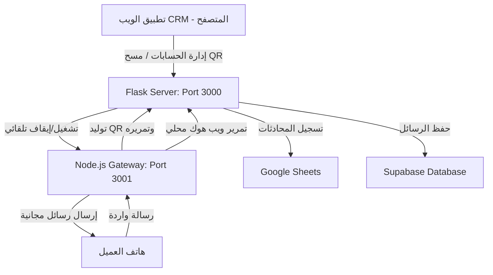

# بوابة الواتساب المحلية المجانية (Free Local WhatsApp Gateway)

هذا المستند يشرح بالتفصيل بنية وإعدادات وطريقة استخدام **بوابة الواتساب المحلية المجانية** التي تم دمجها كبديل للبوابات المدفوعة (مثل UltraMsg و Green API).

---

## 🏗️ بنية وتصميم النظام (Architecture)

يتكون النظام المحلي من جزأين يعملان معاً بشكل متناغم:



### 1. خادم الفلاسك المحلي (`webhook_server.py` - Port 3000)
هو الخادم الرئيسي للنظام. يقوم بالمهام التالية:
* **التشغيل التلقائي:** تشغيل بوابة Node.js في الخلفية كعملية فرعية (`subprocess`) عند بدء تشغيل الفلاسك، وإغلاقها تلقائياً عند إيقاف السيرفر لضمان عدم بقاء عمليات عالقة.
* **إدارة الحسابات:** إضافة الحسابات، عرضها، وحذفها في قاعدة بيانات Supabase.
* **الـ Webhook المحلي (`/api/whatsapp/webhook/local/<id>`):** استقبال الرسائل الواردة من البوابة المحلية وتوجيهها لتسجيلها في **شيت جوجل للحجوزات والمحادثات** وتفعيل تدفقات التأكيد والتقييمات التلقائية.
* **إرسال الرسائل:** عند إرسال رد من لوحة التحكم، يتحقق السيرفر من نوع المزود؛ فإذا كان `local` يتم توجيه الرسالة فوراً عبر منفذ البوابة المحلية `3001`.

### 2. بوابة Node.js المحلية (`whatsapp_gateway` - Port 3001)
تعتمد على مكتبة **`Baileys`** (وهي مكتبة خفيفة تحاكي بروتوكول واتساب ويب مباشرة عبر WebSockets دون الحاجة لمتصفح Chromium ثقيل):
* **إدارة الجلسات:** حفظ بيانات الاعتماد وملفات التعريف لكل حساب بشكل آمن في مجلد `sessions` المحلي لضمان بقاء الاتصال نشطاً حتى بعد إعادة التشغيل.
* **توليد الـ QR Code:** تصدير رمز الـ QR بصيغة Base64 وتمريره للفلاسك لعرضه في لوحة التحكم.
* **استقبال وإرسال الرسائل:** استقبال الرسائل الواردة من تطبيق الواتساب وإرسالها فوراً إلى الفلاسك عبر الـ Webhook، أو إرسال الرسائل الصادرة من الفلاسك إلى هواتف العملاء.

---

## 🔌 نقاط الاتصال المدمجة (API Endpoints)

تمت إضافة المسارات التالية إلى السيرفر الرئيسي لإدارة العملية بالكامل:

| المسار (Endpoint) | الطريقة (Method) | الوصف |
| :--- | :--- | :--- |
| `/api/whatsapp/instances` | `POST` | إضافة حساب جديد في قاعدة البيانات (محلي أو سحابي). |
| `/api/whatsapp/instances` | `GET` | جلب قائمة كافة الحسابات المسجلة. |
| `/api/whatsapp/instances/<id>` | `DELETE` | حذف الحساب وجلسة الاتصال المرتبطة به. |
| `/api/whatsapp/instance/<id>/status` | `GET` | فحص وتحديث حالة الاتصال (متصل/غير متصل). |
| `/api/whatsapp/instance/<id>/qr` | `GET` | جلب الـ QR كـ Base64 للحسابات المحلية. |
| `/api/whatsapp/webhook/local/<id>` | `POST` | ويب هوك استقبال الرسائل الواردة من البوابة وتمريرها للأتمتة وشيت جوجل. |
| `/api/send_reply` | `POST` | إرسال رسالة من لوحة التحكم (يقوم بالتحويل للبوابة المحلية تلقائياً عند الحاجة). |

---

## 🛠️ دليل البدء السريع والاستخدام

### الخطوة 1: تشغيل السيرفر
قم بتشغيل السيرفر المحلي كالمعتاد:
```bash
python webhook_server.py
```
*سيقوم السيرفر تلقائياً بالتحقق من وجود حزم الـ Node وتثبيتها إذا لم تكن موجودة، ثم يبدأ بتشغيل البوابة المحلية على المنفذ `3001`.*

### الخطوة 2: إضافة الحساب في لوحة التحكم (CRM)
1. افتح صفحة لوحة التحكم `admin-crm.html` في المتصفح.
2. توجه إلى **إعدادات الواتساب (WhatsApp settings)**.
3. اضغط على زر **إضافة حساب (Add Instance)**.
4. اختر من قائمة المزودين: **بوابة محلية مجانية (Free Local Gateway)**.
5. أدخل اسماً اختيارياً للحساب (مثل: الرقم الأساسي) واضغط على **حفظ (Save)**.
   * *سيتم إخفاء حقل الـ Token تلقائياً وتعيين رابط البوابة الافتراضي `http://localhost:3001`.*

### الخطوة 3: مسح الـ QR Code
1. بعد حفظ الحساب، سيظهر في قائمة الحسابات.
2. سيقوم النظام بتوليد الـ QR Code وعرضه أمامك خلال ثوانٍ.
3. افتح تطبيق واتساب على هاتفك -> **الأجهزة المرتبطة** -> **ربط جهاز** -> امسح الـ QR الـظاهر.
4. بمجرد نجاح المسح، ستتغير حالة الحساب في لوحة التحكم إلى **متصل (Connected)** وسيتم تحديث رقم الهاتف المرتبط تلقائياً في قاعدة البيانات والـ CRM.

---

## 💡 ملاحظات هامة وحلول المشاكل

* **استمرارية الاتصال:** يتم حفظ بيانات الجلسة محلياً في مجلد `whatsapp_gateway/sessions/session_<instance_id>`؛ مما يعني أنه عند إعادة تشغيل السيرفر أو الجهاز، سيقوم الحساب بالاتصال تلقائياً دون الحاجة لإعادة مسح الـ QR مرة أخرى.
* **الويب هوك الخارجي:** إذا تم تشغيل السيرفر على خادم خارجي (أو باستخدام ngrok)، سيقوم السيرفر بربط مسار الـ Webhook تلقائياً لكي يضمن وصول الرسائل دائماً للمسار الصحيح.
* **فصل الاتصال:** إذا قمت بتسجيل الخروج من الهاتف أو حذفت الحساب من الـ CRM، سيقوم النظام تلقائياً بحذف مجلد الجلسة المحلي وتنظيف بيانات الاتصال.
